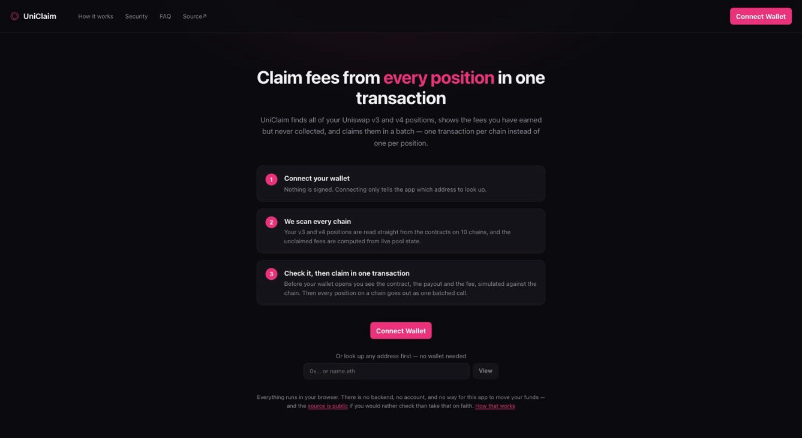
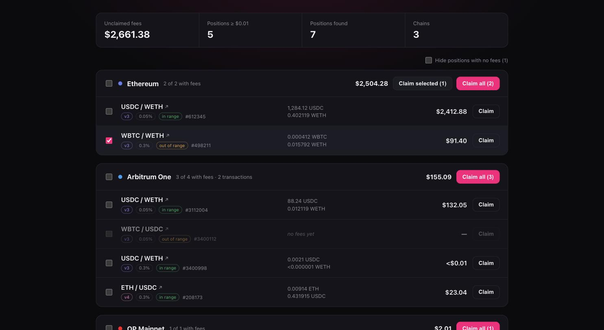

# UniClaim

Claim the unclaimed fees from **every** Uniswap v3 and v4 position you own — one transaction per
chain instead of one per position.

[](https://github.com/de-don/uniclaim/actions/workflows/ci.yml)

Entirely client-side: no backend, no account, no API keys. Almost everything is read straight from
the contracts over public RPC endpoints; the one exception is v4 position discovery, explained
below. The hosted deployment adds Vercel's page-level analytics — see
[Hosting on Vercel](#hosting-on-vercel).





## Contents

- [Chains](#chains)
- [Running it](#running-it)
- [Reading the list](#reading-the-list)
- [How it works](#how-it-works)
- [Verifying the maths](#verifying-the-maths)
- [Limitations](#limitations)
- [Layout](#layout)
- [Dependencies](#dependencies)
- [Hosting on Vercel](#hosting-on-vercel)
- [Wallet trust](#wallet-trust)
- [Deployment](#deployment)
- [License](#license)

## Chains

| Chain | v3 | v4 |
| --- | :-: | :-: |
| Ethereum | ✅ | ✅ |
| Arbitrum | ✅ | ✅ |
| Optimism | ✅ | ✅ |
| Polygon | ✅ | ✅ |
| Base | ✅ | ✅ |
| Robinhood Chain | ✅ | ✅ |
| BNB Chain | ✅ | — |
| Avalanche | ✅ | — |
| Blast | ✅ | — |
| Celo | ✅ | — |

v4 is deployed on BNB Chain, Avalanche and Blast, but none of them has a public explorer that can
list an address's NFTs without an API key, so positions there cannot be discovered — and the app
says so rather than showing an empty list. On Celo no v4 position manager was found at all. Either
way those chains still show every v3 position.

Contract addresses are pinned per chain, but never assumed: the v3 factory is read out of the
position manager itself, so a typo in one constant cannot silently redirect the maths at some other
pool.

Most chains reuse the canonical `0xC36442b4…` v3 manager address. **Robinhood Chain does not** —
there that address holds an unrelated 2 kB contract which answers no calls, and the real deployment
lives at `0x73991a25…` with its own factory. It was located by tracing the `sender` of v3 pool
`Mint` events, then confirmed three ways: `name()` returns `Uniswap V3 Positions NFT-V1`,
`supportsInterface(0x780e9d63)` is true so enumeration works, and the bytecode matches Ethereum's
byte length exactly, differing only where constructor immutables are baked in.

Its v4 contracts took the same treatment. The position manager (`0x58daec31…`, `UNI-V4-POSM`) was
found from the NFTs an address actually holds and cross-checked against the `PoolManager` that
emits this chain's v4 Swap events; of the fourteen contracts there named `StateView`, only two
report that PoolManager. Adding a chain is therefore not a matter of assuming the usual address.

## Running it

```bash
pnpm install
cp .env.example .env    # optional: WalletConnect id and your own RPC endpoints
pnpm dev
```

Without `VITE_WC_PROJECT_ID` only browser-extension wallets can connect — WalletConnect answers 403
to a placeholder id, so the landing page says as much rather than letting mobile wallets fail
silently. A free id comes from [Reown](https://cloud.reown.com).

Open `#preview` in development for a layout harness with mock positions, no wallet needed.

## Reading the list

Positions with no accrued fees are listed too, greyed out, behind a **Hide positions with no fees**
toggle that is on by default. They are never included in a claim: collecting a zero costs gas and
returns nothing.

The summary reports two counts: how many positions exist at all, and how many carry fees worth at
least $0.01. Dust is excluded from the second because a long tail of it is normal and none of it is
worth a transaction; positions whose tokens have no price quote are counted, since they cannot be
ruled out as dust.

Clicking a position opens it on the Uniswap interface,
`app.uniswap.org/positions/{v3|v4}/{chain}/{tokenId}`. Every chain slug in the config was confirmed
against a live position rather than assumed — including Robinhood Chain, which the interface does
support under `robinhood`. A chain without a slug falls back to the position's NFT on the block
explorer, so adding a chain can never produce a broken link.

## How it works

### 1. Finding positions

For v3: `NonfungiblePositionManager.balanceOf` → `tokenOfOwnerByIndex` → `positions(tokenId)`,
all batched through Multicall3.

v4 is not enumerable — its position manager is not ERC721Enumerable, so there is no
`tokenOfOwnerByIndex` and no contract call that lists what an address holds. The only key-free,
CORS-enabled source of that list is a public Blockscout instance, so candidate ids come from there
and are then confirmed against `ownerOf` on chain. The explorer is treated as an untrusted hint: it
returns numbers, every number is verified, and a wrong answer can only cost a lookup.

Alternatives that were measured and rejected:

| Source | Why not |
| --- | --- |
| `eth_getLogs` over Transfer events | Only Arbitrum's official RPC allows a full-range query. Elsewhere the cap is 2,000–10,000 blocks, or an archive token is required — for Base that is roughly 13,000 requests per scan. |
| Revert Finance API | `access-control-allow-origin` is `https://revert.finance`, so a browser on any other origin cannot read the response; the preflight confirms it. The `uniswapv4` route exists but returned an empty set for an address holding three verified v4 positions, so it would need a server-side proxy *and* would still not answer. |
| The Graph, Alchemy, Ankr NFT APIs | All require an API key, which means a key shipped to the browser or a backend to hold it. |

### 2. Computing fees

The contract's `tokensOwed` goes stale the moment a position is touched, so the live figure is
derived from pool state:

```
feeGrowthInside = feeGrowthGlobal − feeGrowthBelow − feeGrowthAbove
fees            = tokensOwed + liquidity × (feeGrowthInside − feeGrowthInsideLast) / 2¹²⁸
```

Uniswap lets these accumulators overflow on purpose (unchecked uint256), so every subtraction is
done modulo 2²⁵⁶ — see `src/lib/fees.ts`. The upside of this approach is that every call is a
`view`, so the whole scan batches through Multicall3, unlike an `eth_call` of `collect()` which has
to come from the owner.

For v4, `feeGrowthInside` is available directly from the `StateView` periphery contract, so the tick
walk is unnecessary and only the delta against the position's checkpoint remains. v4 keeps no
`tokensOwed`.

On v3 that figure is an upper bound rather than the payout. `collect` ends in `pool.collect`, which
pays at most the `tokensOwed` the pool has accrued for the manager's aggregated position in that
range — and the pool adds to it with a separate floor division on every update, so a sum of floors
can fall a wei or two below the floor of a single-step sum. The scanner therefore also reads the
pool-side position (keyed by `keccak256(manager, tickLower, tickUpper)`, deduplicated since NFTs can
share a range) and takes the smaller of the two. Without this, some positions displayed 1–3 wei more
than a claim returned.

### 3. Claiming

On v3 the selected `collect()` calls are encoded into a `bytes[]` and submitted as a single
`NonfungiblePositionManager.multicall`.

On v4 there is no `collect`: fees are realised by decreasing liquidity by zero and then closing each
currency, all inside one `modifyLiquidities` unlock — one `DECREASE_LIQUIDITY` per position, then
one `CLOSE_CURRENCY` per distinct currency. Closing per currency rather than per pool matters, since
two positions sharing a token would otherwise try to withdraw the same credit twice.

Neither path takes a recipient this app could redirect: v3 `collect` pays the position's owner, and
v4's `CLOSE_CURRENCY` credits the transaction sender. (`TAKE_ALL`, the obvious v4 candidate, is a
router action the position manager rejects with `UnsupportedAction`.)

## Verifying the maths

```bash
pnpm verify        # v3: computed fees vs. the chain itself
pnpm verify:v4     # v4: decoding, fees and claim encoding
pnpm check:rpcs    # probe the bundled public endpoints with a real Multicall3 call
```

`pnpm verify` checks v3 fees against ground truth: for every position it finds, it `eth_call`s
`collect()` as the owner and requires a wei-exact match, across real wallets on six chains.

v4 has no read-only equivalent of `collect`, so `pnpm verify:v4` checks it three other ways:

1. **Decoding.** `getPositionLiquidity(tokenId)` from the position manager must equal the liquidity
   the pool reports for `(poolId, manager, ticks, salt)`. That equality only holds if the pool id,
   the 24-bit tick unpacking and the salt convention are all correct, so one comparison covers all
   three.
2. **Fees.** Positions are scanned end to end against live pools.
3. **Claim encoding.** The batched `modifyLiquidities` call is `eth_call`ed as the owner; a wrong
   action id, parameter layout or currency ordering reverts.

Token ids for these checks are sampled from `nextTokenId` rather than looked up through an explorer,
so the script tests the maths rather than a third-party service.

## Limitations

- **No v2.** v2 has no separate fees — they are reinvested into the LP token and cannot be claimed
  without withdrawing liquidity.
- **v4 discovery needs an explorer.** See the chain table; without one, a chain shows v3 only.
- **v3 fees arrive as WETH.** `collect` pays out WETH rather than native ETH; unwrapping would need
  a separate `unwrapWETH9` inside the same multicall. v4 pools using native ETH pay out native ETH.
- **Gas batching.** More than `MAX_PER_TX` (25) positions on one chain will not fit in a single
  transaction, so they are sent as consecutive batches. A selection spanning both v3 and v4 also
  needs one transaction per protocol.
- **Public RPCs.** A wallet with more than 400 positions on one chain is scanned partially — set
  your own endpoint via `VITE_RPC_<chainId>`.

## Layout

```
src/
  abi/             v3 and v4 contract ABIs
  config/          chains, contract addresses, vetted public RPC lists
  lib/fees.ts      fee maths (wraparound arithmetic), shared by both versions
  lib/multicall.ts chunked batching that surfaces RPC failures instead of hiding them
  lib/scan.ts      v3 position scanner
  lib/v4/          v4 discovery, scanner and claim encoding
  lib/prices.ts    DefiLlama prices (no key) for USD estimates
  lib/links.ts     Uniswap and explorer links
  hooks/           all-chain scanning, claiming
  components/      landing, chain group, position row, summary, info panel
scripts/
  verify-fees.ts   v3 ground-truth check against the chain
  verify-v4.ts     v4 decoding, fee and claim-encoding checks
  check-rpcs.ts    public endpoint probe
```

## Dependencies

Everything is on its current release except two deliberate holds, each of which
looks like a missed upgrade until you know why:

| Package | Held at | Why |
| --- | --- | --- |
| `wagmi` | 2.x | RainbowKit's latest release (2.2.11) still peers on `wagmi@^2.9`. Bumping wagmi to 3.x reintroduces the unmet peer this project started out fixing. |
| `@types/node` | 24.x | The major tracks the Node runtime, and `.nvmrc` pins Node 24. Types for Node 26 would describe APIs this project does not run on. |

### Bundle size

`dist` is around 5.6 MB, which looks alarming and mostly is not: the first load
pulls **10 chunks, 939 KB raw / 292 KB gzip**, plus 37 KB of CSS. Everything else
is code-split behind the wallet modal and downloads only for whoever picks that
particular wallet:

| Lazy weight | Size | Pulled in by |
| --- | --- | --- |
| Coinbase Wallet SDK | ~1.4 MB, plus 1.2 MB across 17 locale chunks | choosing Coinbase |
| WalletConnect / Reown AppKit | ~1.6 MB | choosing a mobile wallet |
| MetaMask SDK | ~529 KB | choosing MetaMask's SDK flow |

There is no Solana SDK in the bundle, despite `@solana-program/*` and
`@solana/kit` appearing in the dependency tree under `@wagmi/connectors` — they
are tree-shaken out. `@solana/kit`, `SystemProgram` and `SOLANA_MAINNET` match
zero chunks. What does ship is a handful of `case "solana":` branches inside
Reown AppKit's chain plumbing, in lazy chunks, weighing almost nothing.

An EVM-only build without WalletConnect was measured as a comparison: 5.6 MB →
4.0 MB on disk, every Solana reference gone — and a first load of 289 KB gzip
instead of 292 KB. The saving is entirely in code nobody downloads unless they
ask for that wallet, so the wallet coverage was kept.

### Security advisories

`pnpm audit` reported one high and four moderate advisories, all transitive
under `@wagmi/connectors`. Before patching them it is worth knowing that **none
of them is reachable here**, which was checked rather than assumed:

| Package | Ships to the browser? | Vulnerable path used? |
| --- | --- | --- |
| `ws` | No — `Sec-WebSocket-Key` and `permessage-deflate` appear in zero bundle chunks, and no code or endpoint here uses a WebSocket transport | No |
| `decode-uri-component` | No — zero chunks | No |
| `uuid` | No — its internals (`unsafeStringify`, `byteToHex`, `rng`) appear in zero chunks; the `uuid` strings in the bundle are unrelated field names, and `randomUUID` there is the platform's own | No — consumers only call `v4`, while the flaw needs a `buf` argument passed to `v3`/`v5`/`v6` |

They are pinned forward anyway, through `pnpm.overrides`, for one reason: a
clean audit means the next advisory — which may well be reachable — stands out
instead of arriving in a pile of noise. Since none of this code ships, the
overrides cannot change the app's behaviour.

- `ws` → `>=8.21.3`, clearing a high-severity memory-exhaustion DoS and an
  uninitialized-memory disclosure. Scoped to `ws@8` on purpose: another branch
  resolves `ws@7`, which the advisory does not cover and which a blanket
  override would drag across a major for nothing.
- `decode-uri-component` → `>=0.5.0`, clearing a DoS on malformed input.
- `uuid` → `^11.1.1`, the smallest jump that clears the advisory.

**Do not raise `uuid` past 11.** Version 12.0.0 removed CommonJS support, and
three consumers here — `@metamask/sdk`, `@metamask/sdk-communication-layer` and
`@metamask/utils` — load it with `require("uuid")`. uuid 11 still publishes a
`require` condition; 12 and later do not. `^11.1.1` was verified by connecting
MetaMask and Rabby against it.

## Hosting on Vercel

Importing the repository is enough — `vercel.json` carries the settings, so
nothing needs filling in by hand:

- **Framework** Vite, **build** `pnpm build`, **output** `dist`. pnpm is picked
  up from the `packageManager` field, and Node from `engines.node` (`>=22`,
  which resolves to the newest available major — Vercel has Node 24).
- **Rewrites** send anything that is not a built asset to `index.html`, so a
  deep link cannot 404 before the app loads.
- **Headers** set `nosniff`, `X-Frame-Options: DENY` (nothing here should be
  framed — a wallet prompt inside someone else's iframe is a phishing pattern),
  a conservative `Referrer-Policy`, a `Permissions-Policy` denying camera,
  microphone, geolocation and payment, and a one-year immutable cache for
  content-hashed assets.

The canonical host is `https://uniclaim.org`, hardcoded in `index.html`
(canonical link, Open Graph, JSON-LD), `public/robots.txt` and
`public/sitemap.xml`, because Open Graph and sitemaps need absolute URLs. Those
five files are the only place the hostname appears; nothing in the app depends
on it.

The apex domain and `www` must **both** be added to the Vercel project, or the
one that is missing gets served the other's certificate and fails the hostname
check — a browser then shows a security warning, which for a wallet-connecting
app is fatal. Set the apex as primary so `www` and the `.vercel.app` URL both
redirect to it: one indexable address, no duplicate content for a crawler to
choose between.

The one thing worth setting in the dashboard is the environment variable
`VITE_WC_PROJECT_ID` (free, from [Reown](https://cloud.reown.com)). Without it
the deployed site can only connect browser-extension wallets, and says so on the
landing page. Do **not** set `VITE_BASE`: it exists for GitHub Pages' `/<repo>/`
prefix, and on a Vercel domain the app is served from the root.

### Analytics

The deployment includes `@vercel/analytics` and `@vercel/speed-insights`, both
mounted once at the app root. Turn them on in the Vercel dashboard under
Analytics and Speed Insights; until then the scripts are inert.

What they collect is page visits and load timings. They are cookieless and set
no cross-site identifier. They are deliberately wired at page level only — this
app sends no custom events anywhere, so **a wallet address is never part of what
Vercel receives**. Running locally or self-hosting sends them nothing at all.

This is a real change to what the app claims, so the wording in the UI changed
with it. The landing page used to promise "no tracking" and the FAQ "no
analytics"; both are gone. The landing page does not enumerate the exception —
its remaining claims (no backend, no account, no way to move your funds) are all
still true, and a hero paragraph is not the place for a full disclosure — while
the FAQ's list of outgoing requests carries the detail, alongside the RPC nodes,
DefiLlama and the block explorer.

The distinction worth keeping: not listing every exception up front is fine;
claiming something you do not do is not. Whatever else changes here, that "no
tracking" line must not come back while analytics are on.

## Wallet trust

Wallets warn about sites their reputation engines have never seen, and a domain
registered this month is exactly that. Two halves to fixing it, and only one
lives in this repository.

**In the code.** The connect config passes `appName`, `appDescription`, `appUrl`
and `appIcon`, which is what a wallet renders on its approval screen. The icon
is `icon-512.png` — raster on purpose, since wallet UIs fetch it from their own
context and handle SVG unevenly — and the URL is absolute for the same reason. A
prompt where the name, icon and origin agree reads as an application; a blank
icon and no description is what a phishing page looks like.
`/.well-known/security.txt` gives researchers somewhere to report, which
scanners look for; private vulnerability reporting is enabled on the repository
so a reporter has a channel that is not a public issue.

**Outside the code**, and this is the part that actually clears warnings.
Submission points, each checked to exist rather than copied from memory:

| Where | Why |
| --- | --- |
| [report.blockaid.io](https://report.blockaid.io) | Blockaid powers the warnings in MetaMask and others; this is where a false positive gets appealed. |
| [app.chainpatrol.io/report](https://app.chainpatrol.io/report) | ChainPatrol feeds allow/block lists used across several wallets. |
| [scamsniffer.io](https://scamsniffer.io) | Widely used phishing detection; has a contact route for false positives. |
| [walletguard.app](https://www.walletguard.app) | Same, for the Wallet Guard extension. |

Rabby has a dApp directory, but it is not at `rabby.io/dapps` — that URL is a
404. Reach them through their GitHub or Discord rather than guessing a link.

One thing no submission substitutes for: **domain age**, which is only time.
The other half — verifiable source — is covered: the repository is public, and
the app links to it from the header, the landing page and the Security panel.

## Deployment

Vercel handles the hosted site; the workflows below cover CI and an alternative
GitHub Pages target.

`.github/workflows/ci.yml` runs lint, typecheck and build on every push and pull request to `main`.

`.github/workflows/pages.yml` builds the site and deploys it to GitHub Pages. It stays **manual**
(`workflow_dispatch`) — not because it cannot run now that the repository is public, but because
Vercel serves `uniclaim.org` and a second live copy of the site would be a duplicate for crawlers
to weigh against the canonical one. Uncomment the `push` trigger only if Pages becomes the primary
target.

The build reads its URL prefix from `VITE_BASE`, which the workflow takes from the Pages
configuration rather than hardcoding — a project site is served from `/<repo>/`, and without the
prefix every asset would 404. `dist/404.html` is a copy of `index.html` so client-side routes
survive a direct hit.

Set `VITE_WC_PROJECT_ID` as a repository secret to enable WalletConnect on the deployed site.

## License

[Business Source License 1.1](LICENSE) — the same license Uniswap itself uses.

The source is published for reading, auditing and personal use. You may run it for yourself,
including against your own wallets. You may **not** put it into commercial or production service,
and you may not offer it to others as a service or product. On **2030-09-18** the license converts
automatically to the GNU General Public License v2.0 or later.

Note what this does and does not restrict: BUSL permits copying, modification and redistribution for
non-production use — study it, fork it, send a patch. What it withholds is production use beyond the
personal grant above. For anything else, ask.

© 2026 Denis Dontsov.
